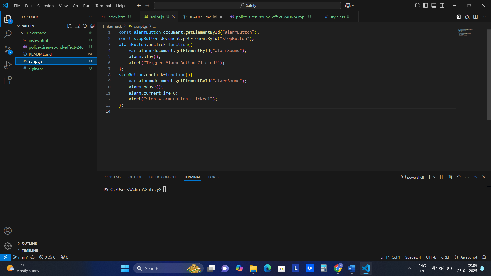

# Safety Alarm  🎯

## Basic Details
### Team Name: 404 Squad

### Team Members
- Member 1: Navaneetha M D - LBS Institute of Technology for Women
- Member 2: Neethu Sudarsanan - LBS Institute of Technology for Women

### Hosted Project Link
https://github.com/navaneetha-m-d/Tinkerhack.git

### Project Description
This is an application designed to ensure safety during emergency situations. It makes a loud siren alert and dial emergency contact.

### The Problem statement
Many people feels threatened when they are alone and many crimes are occuring due to delayed help arrival.

### The Solution
During emergencies people usually panic and delays contacting help . This application solves the delay in contacting help by providing an easy way with the help of a single button.

## Technical Details
### Technologies/Components Used
For Software:
- Java Script
- css
- html

### Project Documentation
For Software:

# Screenshots (Add at least 3)

Code for triggering and stopping the alarm in javascript

Code for the layout,text,buttons of the page in html

Code for styling the document in css

![Final]
Here when we click on the trigger alarm , a siren rings and when we click on the stop alarm , the siren stops

## Team Contributions
- Navaneetha M D:written the js code and debug the code
- Neethu Sudarsanan: wriiten the html and css code

---
Made with ❤️ at TinkerHub
